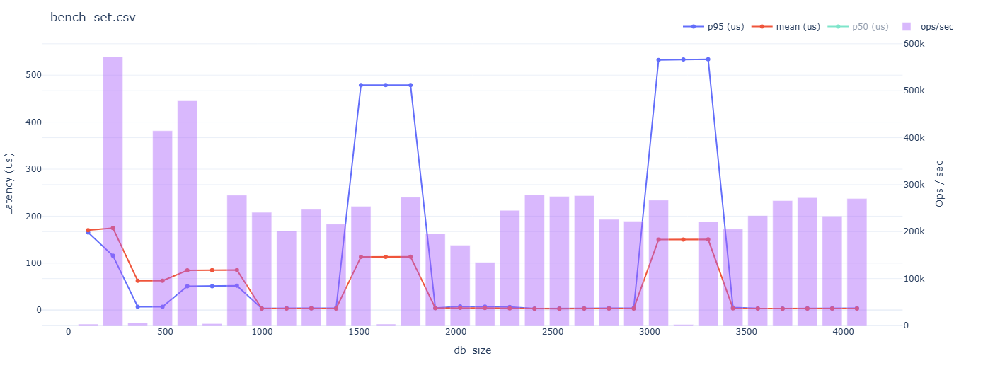
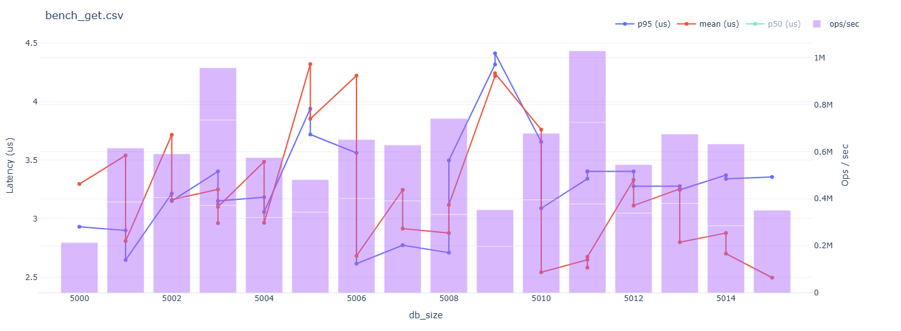
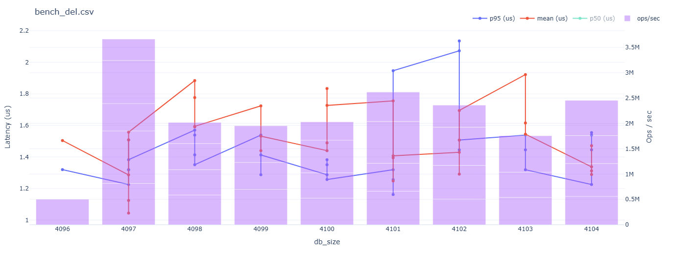

[](https://crates.io/crates/turbocache)
[](https://crates.io/crates/turbocache)
[](https://github.com/frozen-lab/turbocache/commits/main)
[](https://github.com/frozen-lab/turbocache/pulls)
[](https://github.com/frozen-lab/turbocache/issues)
[](https://github.com/frozen-lab/turbocache/blob/master/LICENSE)

[](https://github.com/frozen-lab/turbocache/actions/workflows/linux_arm.yml)
[](https://github.com/frozen-lab/turbocache/actions/workflows/linux_x86.yml)
[](https://github.com/frozen-lab/turbocache/actions/workflows/win_arm.yml)
[](https://github.com/frozen-lab/turbocache/actions/workflows/win_x86.yml)

# TurboCache

A persistant and embedded KV Database built for on-device caching.

### Overview

- [Installation](#installation)
- [API](#api)
- [Performance](#performance)
- [Architecture](#architecture)
- [Memory Usage](#memory-usage)
- [Limitations](#limitations)

## Installation

Install **Turbocache** using `cargo`,

```sh
cargo add turbocache
```

## API

Example usage of all public methods,

```rust
use turbocache::TurboCache;

fn main() {
    const INITIAL_CAPACITY: usize = 1024;
    let path = std::env::temp_dir().join("cache-dir");
    let cache = TurboCache::new(path, INITIAL_CAPACITY).unwrap();

    // inserts 5 kev-value pairs into the cache
    for i in 0..5 {
        cache.set(&vec![i], &vec![i * 10]).unwrap();
    }

    // fetch key(3) from cache
    assert_eq!(cache.get(&vec![3]).unwrap(), Some(vec![30]));

    // delete key(3) from cache
    assert_eq!(cache.del(&vec![3]).unwrap(), Some(vec![30]));

    let mut keys = Vec::new();

    // iterate over all keys inserted in cache
    for res in cache.iter().unwrap() {
        let (k, _) = res.unwrap();

        keys.push(k);
    }

    // match keys vector's length w/ total number for keys in cache
    assert_eq!(keys.len(), cache.total_count().unwrap());
}
```

Refer to [docs.rs](https://docs.rs/turbocache/0.0.5/turbocache/struct.TurboCache.html) for in detailed documentation.

## Performance

### Benchmark Machine

All performance benchmarks are conducted on following potato (🥔) machine,

* **OS**: Windows 64-bit (`WSL2 NixOS 24.11 (Vicuna)`)
* **Kernel**: Linux 6.6.87.2-microsoft-standard-WSL2
* **CPU**: Intel Core i5-10300H @ 2.50GHz
* **Architecture**: x86/64

### Common Benchmarks (p50/median)

| Operation           | Latency (p50)                 | Throughput (p50)                   | Outliers (Total)            |
| ------------------- | ----------------------------- | ---------------------------------- | --------------------------- |
| **set**             | ~ 1.43 µs                     | ~ 0.695 Million pairs/s            | ~ 20%                       |
| **get**             | ~ 0.49 µs                     | ~ 2.034 Million pairs/s            | ~ 07%                       |
| **del**             | ~ 0.11 µs                     | ~ 8.347 Million pairs/s            | ~ 02%                       |

*NOTE*: Benchmarks are derived from 256 samples collected from millions of iterations per opeation.

### Operations at Scale

`set` operation at scale,



`get` operation at scale,



`del` operation at scale,



## Architecture

**TurboCache (TC)** is nothing but a fancy HashTable on disk. But unlike in-mem HashTables, TC uses immutable tables
which can not grow beyound their initial capacity. This limitation provides the capability to `mmap` headers and `pwrite`
into the file which brings heavy performance gains. Despite the table being unable to grow after creation, TC can grow
as much as user wants, well almost! Refer to [limitations](#limitations) to know more.

When initial table has reached it's capacity, a staging table is created w/ 2x the capacity of the original. As new insert
operations are conduceted, incremental migration is done on this table, and eventually staging table is prompted to live.
This cycle again repeats itself, when the live table reaches its capcity. This brings that capability to grow w/ the data.

## Memory Usage

On-Disk tables are mmaped for faster lookup operations. At initial capcity 1024 (pairs), the memory usage is ~ 12.029 KiB.
As no. of inserted pairs grow the memory usage grows too.

For when staging is active, the memory usage spikes to 3x of the original and goes back to 2x (increased capacity) when
the migrations are done.  

## Limitations

- Lengths:

    Key and Values lengths at capped at max 4096 bytes (2^12).

- Size:
 
    A table can contain at most 1024 Gib of data. Insertion beyound this will not be allowed. In rare case, where
    usage can cross this limit, another instance of **TurboCache** can be created w/ diff directory.

